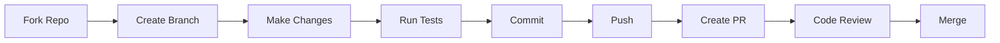

# Contributing to Unikey for macOS

Đầu tiên, cảm ơn bạn đã quan tâm đến việc đóng góp cho Unikey!

First off, thank you for considering contributing to Unikey!

[Tiếng Việt](#hướng-dẫn-đóng-góp) | [English](#contribution-guidelines)

---

## Hướng dẫn đóng góp

### Mục lục

- [Quy tắc ứng xử](#quy-tắc-ứng-xử)
- [Cách đóng góp](#cách-đóng-góp)
- [Quy trình phát triển](#quy-trình-phát-triển)
- [Coding Standards](#coding-standards)
- [Commit Messages](#commit-messages)

### Quy tắc ứng xử

Dự án này tuân theo các nguyên tắc sau:

- **Tôn trọng lẫn nhau**: Mọi đóng góp đều được đánh giá cao
- **Xây dựng tích cực**: Phản hồi mang tính xây dựng
- **Hợp tác**: Làm việc cùng nhau vì mục tiêu chung
- **Minh bạch**: Thảo luận công khai về các quyết định

### Cách đóng góp

#### Báo cáo lỗi (Bug Reports)

1. Kiểm tra [Issues](https://github.com/hieunguyen1053/Unikey/issues) để xem lỗi đã được báo cáo chưa
2. Nếu chưa, [tạo Bug Report](https://github.com/hieunguyen1053/Unikey/issues/new?template=bug.yml) với mô tả chi tiết

#### Đề xuất tính năng (Feature Requests)

Sử dụng [Feature Request Template](https://github.com/hieunguyen1053/Unikey/issues/new?template=feature_request.yml) để đề xuất tính năng mới.

#### Cải tiến (Improvements)

Sử dụng [Improvement Template](https://github.com/hieunguyen1053/Unikey/issues/new?template=improvement.yml) để đề xuất cải tiến cho chức năng hiện có hoặc bổ sung tài liệu.

#### Pull Requests

1. Fork repository
2. Tạo branch mới:
   ```bash
   git checkout -b feature/my-awesome-feature
   # hoặc
   git checkout -b fix/bug-description
   ```
3. Commit changes với message rõ ràng
4. Push và tạo Pull Request
5. Đợi review và phản hồi

### Quy trình phát triển



1. **Fork và Clone**
   ```bash
   git clone https://github.com/YOUR_USERNAME/Unikey.git
   cd Unikey
   git remote add upstream https://github.com/hieunguyen1053/Unikey.git
   ```

2. **Sync với upstream**
   ```bash
   git fetch upstream
   git checkout main
   git merge upstream/main
   ```

3. **Chạy tests**
   ```bash
   xcodebuild test -scheme Unikey -destination 'platform=macOS'
   ```

### Coding Standards

#### Swift Style Guide

- Tuân theo [Swift API Design Guidelines](https://swift.org/documentation/api-design-guidelines/)
- Sử dụng 4 spaces cho indentation
- Maximum line length: 120 characters
- Sử dụng meaningful variable names

#### Cấu trúc code

```swift
// MARK: - Properties
private var engine: UkEngine

// MARK: - Initialization
init() {
    // ...
}

// MARK: - Public Methods
func processKey(_ key: String) -> Bool {
    // ...
}

// MARK: - Private Methods
private func updateState() {
    // ...
}
```

### Commit Messages

Sử dụng format sau:

```
<type>(<scope>): <subject>

<body>

<footer>
```

**Types:**
- `feat`: Tính năng mới
- `fix`: Sửa lỗi
- `docs`: Cập nhật tài liệu
- `style`: Format code (không thay đổi logic)
- `refactor`: Refactor code
- `test`: Thêm hoặc sửa tests
- `chore`: Maintenance tasks

**Ví dụ:**
```
feat(engine): add support for new tone placement algorithm

Implement the modern Vietnamese tone placement rules
based on the official orthography guidelines.

Closes #123
```

---

## Contribution Guidelines

### Table of Contents

- [Code of Conduct](#code-of-conduct)
- [How to Contribute](#how-to-contribute)
- [Development Process](#development-process)
- [Coding Standards](#coding-standards-1)
- [Commit Messages](#commit-messages-1)

### Code of Conduct

This project follows these principles:

- **Mutual Respect**: All contributions are valued
- **Constructive Feedback**: Focus on building up, not tearing down
- **Collaboration**: Work together towards common goals
- **Transparency**: Open discussion about decisions

### How to Contribute

#### Bug Reports

1. Check existing [Issues](https://github.com/hieunguyen1053/Unikey/issues)
2. If not reported, [create a Bug Report](https://github.com/hieunguyen1053/Unikey/issues/new?template=bug.yml) with detailed description

#### Feature Requests

Use the [Feature Request Template](https://github.com/hieunguyen1053/Unikey/issues/new?template=feature_request.yml) to suggest new features.

#### Improvements

Use the [Improvement Template](https://github.com/hieunguyen1053/Unikey/issues/new?template=improvement.yml) to suggest improvements for existing functionality or documentation.

#### Pull Requests

1. Fork the repository
2. Create a new branch:
   ```bash
   git checkout -b feature/my-awesome-feature
   # or
   git checkout -b fix/bug-description
   ```
3. Commit changes with clear messages
4. Push and create a Pull Request
5. Wait for review and feedback

### Development Process

1. **Fork and Clone**
   ```bash
   git clone https://github.com/YOUR_USERNAME/Unikey.git
   cd Unikey
   git remote add upstream https://github.com/hieunguyen1053/Unikey.git
   ```

2. **Sync with upstream**
   ```bash
   git fetch upstream
   git checkout main
   git merge upstream/main
   ```

3. **Run tests**
   ```bash
   xcodebuild test -scheme Unikey -destination 'platform=macOS'
   ```

### Coding Standards

#### Swift Style Guide

- Follow [Swift API Design Guidelines](https://swift.org/documentation/api-design-guidelines/)
- Use 4 spaces for indentation
- Maximum line length: 120 characters
- Use meaningful variable names

### Commit Messages

Use the following format:

```
<type>(<scope>): <subject>

<body>

<footer>
```

**Types:**
- `feat`: New feature
- `fix`: Bug fix
- `docs`: Documentation updates
- `style`: Code formatting (no logic changes)
- `refactor`: Code refactoring
- `test`: Add or modify tests
- `chore`: Maintenance tasks

---

<div align="center">

## Areas Where We Need Help

| Area | Description | Difficulty |
|------|-------------|------------|
| Bug Fixes | Fix reported issues | Easy - Medium |
| Documentation | Improve docs and guides | Easy |
| Testing | Add more unit tests | Medium |
| Localization | Add more languages | Easy |
| Features | Implement new features | Medium - Hard |
| UI/UX | Improve user interface | Medium |

---

**Questions?** Feel free to open an issue or reach out!

**Câu hỏi?** Hãy mở issue hoặc liên hệ với chúng tôi!

</div>
